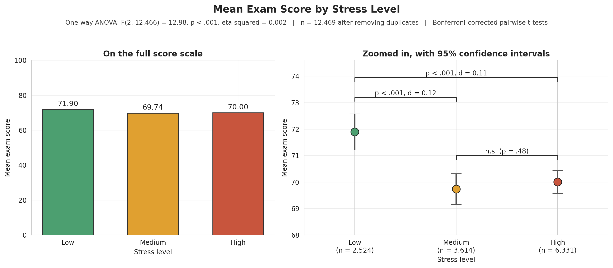
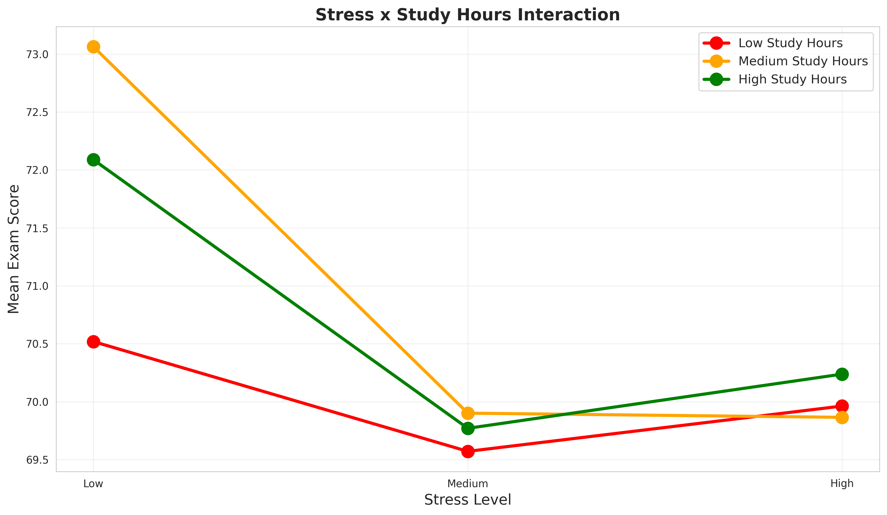
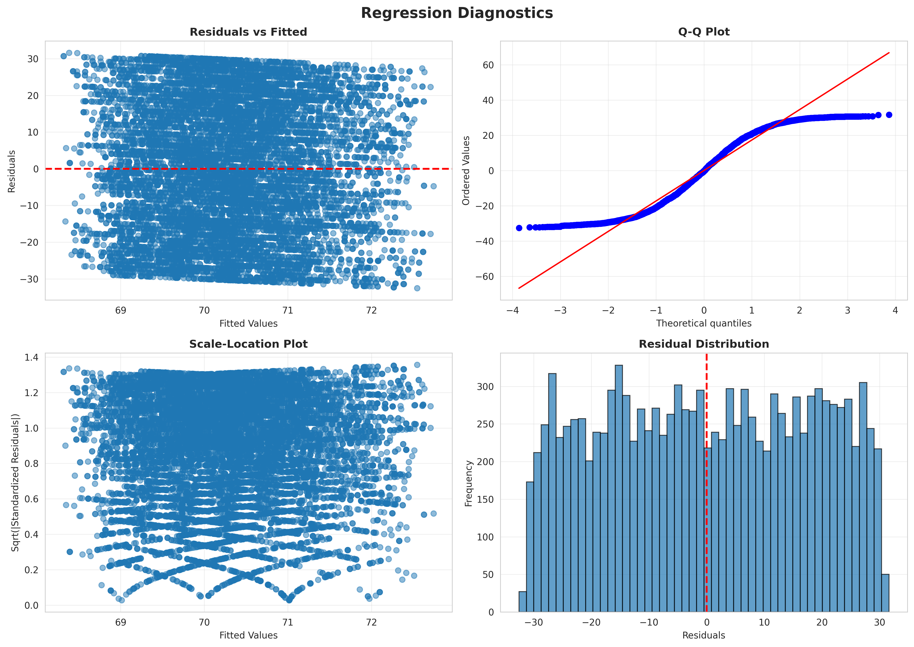

# Stress and Exam Performance


Does a student's stress level predict how well they do on exams? This project tests that question on 12,469 student records using ANOVA, multiple regression, and moderation analysis in Python.

The short answer: low-stress students did score slightly higher, and with a sample this large the difference is statistically significant. But stress level explains about 0.2% of the variation in exam scores, so it tells you almost nothing about how any individual student will perform. Separating statistical significance from practical significance is the main lesson of this analysis.



## Key Findings

- **Low-stress students scored about 2 points higher** than medium- and high-stress students (71.9 vs. 69.7 and 70.0 on a 40–100 scale).
- **The effect is negligible in practical terms.** η² = .002 for the ANOVA, and Cohen's d is about 0.1 for both significant pairwise differences.
- **Medium and high stress were indistinguishable** (p = .48). The data show "low stress vs. everyone else," not a curved or U-shaped relationship.
- **Study hours did not moderate the stress effect.** The stress × study hours interaction was not significant (p = .30).
- **None of the predictors meaningfully explain exam scores.** A model with stress, study hours, attendance, motivation, and assignment completion explained 0.22% of the variance. Its prediction error (RMSE = 17.68) is essentially the same as simply predicting the average score for everyone (SD = 17.70).

## Data

**Source:** Najem, Ziti, and Zaoui Seghroucheni (2025), *Student Performance and Learning Behavior Dataset for Educational Analytics*, Zenodo. [doi.org/10.5281/zenodo.16459132](https://doi.org/10.5281/zenodo.16459132)

The dataset contains 14,003 records and 16 variables. According to its authors, it was created by merging two publicly available Kaggle datasets. Variables cover study behavior (study hours, attendance, assignment completion, online courses, discussion participation), resources and learning environment, motivation, stress, demographics (gender, age 18–30), learning style, and two performance measures (`ExamScore` and `FinalGrade`).

**Variables used in this analysis:**

| Variable | Description |
| --- | --- |
| `ExamScore` | Outcome. Exam score from 40 to 100 (mean 70.31, SD 17.70) |
| `StressLevel` | Predictor. Coded 0, 1, 2 and treated here as low, medium, high |
| `StudyHours` | Weekly study hours (5–44) |
| `Attendance` | Attendance percentage (60–100) |
| `AssignmentCompletion` | Assignment completion percentage (50–100) |
| `Motivation` | Motivation rating, coded 0–2 |

Two notes on the data. First, the dataset documentation doesn't define the stress codes, so the low/medium/high labels are an assumption based on the 0–2 ordering. Second, `FinalGrade` is a binned version of `ExamScore` (0 = 85–100, 1 = 70–84, 2 = 55–69, 3 = 40–54), so it wasn't analyzed as a separate outcome.

### Cleaning

- **Duplicates:** Found and removed 1,534 exact duplicate rows (10.95% of the original data), leaving 12,469 records. Duplicates at this scale are plausibly a by-product of merging the two source datasets.
- **Missing values:** None.
- **Validity checks:** No out-of-range values. All exam scores fall between 40 and 100, all stress codes between 0 and 2, and there were no IQR outliers in `ExamScore`.
- **Derived variables:** Stress categories, performance bands, a binary high-performer flag (score ≥ 70), study-hour terciles, and an engagement composite (mean of attendance, assignment completion, discussions, and online courses).

**Group sizes after cleaning:**

| Stress level | n | % |
| --- | --- | --- |
| Low | 2,524 | 20.2% |
| Medium | 3,614 | 29.0% |
| High | 6,331 | 50.8% |

## Results

All results below use the cleaned data (n = 12,469).

### 1. Exam scores by stress level (one-way ANOVA)

| Stress level | Mean | SD | n |
| --- | --- | --- | --- |
| Low | 71.90 | 17.51 | 2,524 |
| Medium | 69.74 | 17.83 | 3,614 |
| High | 70.00 | 17.66 | 6,331 |

F(2, 12466) = 12.98, p < .001, η² = .002

### 2. Pairwise comparisons (Bonferroni-corrected, α = .0167)

| Comparison | Mean difference | t | p | Cohen's d |
| --- | --- | --- | --- | --- |
| Low vs. Medium | 2.16 | 4.69 | < .001 | 0.12 |
| Low vs. High | 1.89 | 4.57 | < .001 | 0.11 |
| Medium vs. High | −0.26 | −0.71 | .479 | — |

### 3. Regression

**Simple regression** (exam score on stress level): each one-step increase in stress is associated with a 0.77-point lower exam score (p < .001, R² = .001). The correlation between stress and exam score is r = −.03.

**Multiple regression** with five predictors. Coefficients are the change in exam points for a one-standard-deviation increase in each predictor:

| Predictor | Coefficient | p |
| --- | --- | --- |
| Stress level | −0.62 | < .001 |
| Assignment completion | +0.49 | .002 |
| Attendance | −0.26 | .097 |
| Study hours | +0.08 | .611 |
| Motivation | −0.07 | .666 |

R² = .0022 (0.22% of variance explained). RMSE = 17.68, compared with an exam score SD of 17.70.

Stress level and assignment completion are statistically significant, but each shifts the predicted score by less than one point per standard deviation, on a scale where scores span 60 points.

### 4. Moderation: does study time buffer the effect of stress?

A model with mean-centered stress, study hours, and their interaction found no moderation:

- Interaction coefficient: b = −0.035, p = .303
- R² change from adding the interaction: .0001



*The y-axis on this chart covers only about four points, which makes the lines look farther apart than they are. The interaction is not statistically significant.*

### 5. Other subgroup checks

These comparisons were descriptive; no formal tests were run.

- **Gender and motivation:** The stress pattern looked similar across groups. Every subgroup mean fell between 69.1 and 72.1.
- **High-stress students who scored ≥ 80 vs. < 60:** The two groups (2,156 and 2,116 students) were nearly identical on study hours (19.9 vs. 20.0), attendance (80.0 vs. 80.8), and motivation (0.90 vs. 0.92). Assignment completion differed by about 2 points (75.9 vs. 73.7).

### 6. Regression diagnostics

Residuals are not normally distributed (Shapiro–Wilk W = 0.957, p < .001, on a random subsample of 5,000 residuals). The residuals are light-tailed rather than skewed, which reflects the roughly uniform spread of exam scores between 40 and 100. With more than 12,000 observations, coefficient estimates and p-values are robust to this departure from normality.



## Interpretation

The data support a narrow conclusion: students reporting low stress scored slightly higher on average than students reporting medium or high stress. Medium and high stress did not differ from each other, so the pattern is a small step down from low stress rather than a curve.

The effect is small enough to have little practical value on its own. Stress level, study habits, attendance, and motivation together explain almost none of the variation in exam scores here. With n > 12,000, even trivial differences reach significance, which is why effect sizes are reported alongside every test.

This data also can't speak to individualized models of performance and arousal, such as the Individual Zones of Optimal Functioning (IZOF) model. Those models predict that the best stress level differs from person to person. Testing them would require repeated measurements of each individual's stress and performance, not a single three-level rating per student.

## Limitations

- **Cross-sectional data.** Each student is measured once, so the analysis shows association, not cause.
- **Coarse stress measure.** Stress is a single three-level code, not a validated scale, and the dataset doesn't document what the codes mean.
- **Merged secondary data.** The dataset combines two Kaggle sources, and the original collection methods aren't described. No pair of variables in the cleaned data correlates above |r| = .05, which suggests the merged records may not carry much real signal. Results should be read with that in mind.

## Future Directions

- Repeat the analysis on data with a validated stress measure (for example, the Perceived Stress Scale) and repeated measurements, which would allow within-person and individual-zone analyses.
- Test whether stress relates differently to other outcomes, such as course completion or grade changes over time.
- Explore whether nonlinear models find any structure the linear models miss, while comparing them against a simple mean-prediction baseline.

## Methods and Tools

- **Python:** pandas and NumPy for data handling; SciPy and statsmodels for ANOVA, t-tests, OLS regression, and diagnostics; scikit-learn for standardization and fit metrics; matplotlib and seaborn for visualization.
- **Workflow:** four Jupyter notebooks, run in order:

| Notebook | Purpose |
| --- | --- |
| `01_initial_data_exploration.ipynb` | First look at the raw data: structure, distributions, data-quality checks |
| `02_data_cleaning.ipynb` | Duplicate removal, validity checks, derived variables; writes `data/processed/cleaned_data.csv` |
| `03_targeted_EDA.ipynb` | Correlations, subgroup comparisons, and figures |
| `04_statistical_analysis.ipynb` | ANOVA, post-hoc tests, regression, moderation, diagnostics |

Notebook 01 explores the raw file before duplicates are removed, so its preliminary statistics (for example, F = 13.81) differ slightly from the final results. All reported results come from the cleaned data in notebooks 02–04.

## Reproducing the Analysis

```bash
git clone https://github.com/LKohn4/stress_outcomes_analysis.git
cd stress_outcomes_analysis
pip install -r requirements.txt
jupyter notebook
```

Then open the `notebooks/` folder and run the notebooks in order (01 → 04).

## Project Structure

```
stress_outcomes_analysis/
├── data/
│   ├── raw/najeemetal25.csv          # Original dataset (14,003 rows)
│   └── processed/cleaned_data.csv    # After cleaning (12,469 rows)
├── notebooks/                        # Analysis notebooks 01–04
├── figures/                          # Charts exported by the notebooks
├── requirements.txt
└── README.md
```

## Data License and Citation

The dataset is licensed under [Creative Commons Attribution 4.0 International (CC BY 4.0)](https://creativecommons.org/licenses/by/4.0/) and is redistributed here with attribution.

> Najem, K., Ziti, S., & Zaoui Seghroucheni, Y. (2025). *Student Performance and Learning Behavior Dataset for Educational Analytics* (Version 1) [Data set]. Zenodo. https://doi.org/10.5281/zenodo.16459132

## Author

**Leo Kohn**
M.S. in Kinesiology (Performance Psychology), University of Illinois Chicago
[leo@kohn.be](mailto:leo@kohn.be) · [GitHub](https://github.com/LKohn4)
